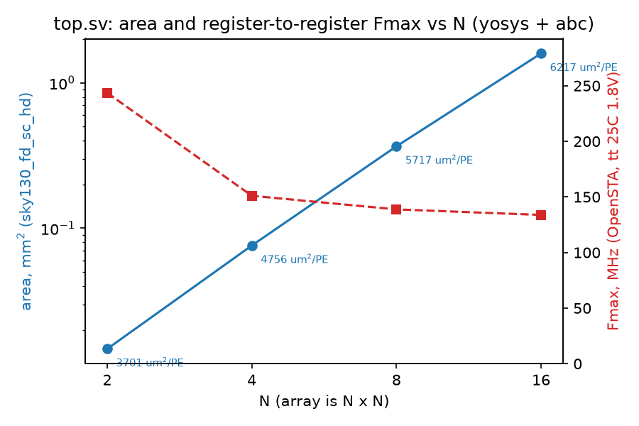
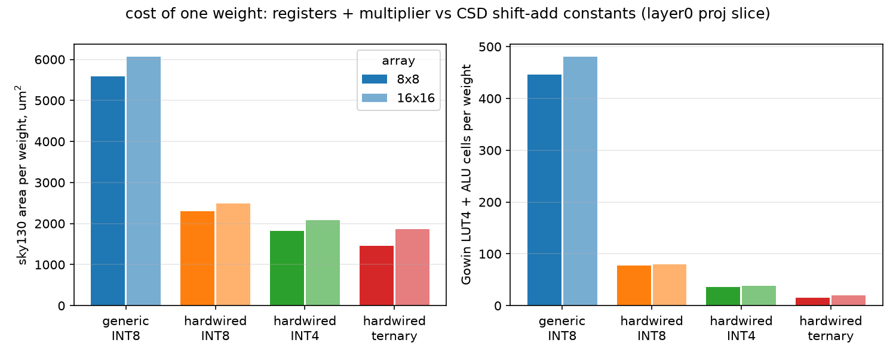

# llm-to-rtl

Weights-in-silicon LLM inference: a compiler from Hugging Face safetensors to
synthesisable SystemVerilog with the model's weights baked into weight-stationary
systolic arrays, and a self-trained GPT that runs end to end in RTL, bit-exact against
an integer reference, with the FPGA flow for a Tang Nano 20K.

The tiny GPT is verified end to end in simulation. SmolLM2 is verified per matrix;
there is no complete SmolLM2 inference engine. The Tang Nano build routes and packs,
but has not been flashed or measured on hardware.

[Results and limitations](docs/report.md) · [Interfaces and numerics](docs/spec.md)




## Part 1: the array

`rtl/pe.sv` and `rtl/array.sv` are the INT8 multiply-accumulate cell and the N x N
grid. `rtl/skew.sv` and `rtl/top.sv` add the
input skew, output deskew and a valid pipeline so the grid behaves as a matmul unit:
`y = x @ W` comes out exactly 2N-1 cycles after `x` goes in, one vector per cycle.

- `tb/test_array.py`, `tb/test_top.py`: random INT8 matrices at N = 4, 8, 16, bit-exact
  against NumPy on Verilator and Icarus, latency checked on every vector.
- `syn/sweep.py`: yosys + abc to sky130, OpenSTA timing. 3.7k um^2 per PE at N=2
  rising to 6.2k at N=16 (flattening lets the top rows drop adder bits); 134 MHz
  register to register at N=16. `docs/area_fmax_vs_N.png`.

## Part 2: the compiler

`compiler/compile.py model_dir --bits 8 --out gen/name --tile 8` reads safetensors and
config.json, quantises every weight matrix, and writes one module per matrix with the
weights fixed: a ROM beside one TxT array (`rtl/matvec_rom.sv`) for big matrices, or a
fully hardwired array where every weight is a CSD shift-add in its own cell
(`--const-max`) for small ones. Each module gets a cocotb test against torch's integer
`linear`, and `run_tests.py -j` runs them all.

- Runs on the tiny GPT (9 matrices, 102k weights) and on SmolLM2-135M (211 matrices,
  134M weights, the 28M-weight tied lm_head included). Every module passes.
- `syn/bitwidth.py`: what one weight costs. Generic INT8 PE 5.6k um^2; hardwired INT8
  2.3k; INT4 1.8k; ternary 1.5k. The floor is the pipeline registers, not the
  multiplier. `docs/area_per_weight.png`.

## Part 3: the whole model

`model/train.py` is Karpathy's "Let's build GPT" scaled to 2 layers, d=64, 4 heads,
context 32 (110k parameters, val loss 1.71 on tiny Shakespeare). `compiler/golden_gpt.py`
folds LayerNorm into the following Linear, calibrates activation ranges, and defines
the integer model: int8 matvecs with fixed-point requantisation, integer LayerNorm
with a bit-serial square root, LUT softmax, int16 residual stream. The int8 model
agrees with the float model on 95% of next-token argmaxes and is 0.004 nats worse.

The RTL is that integer model, block for block: `requant.sv`, `layernorm.sv`
(`isqrt.sv`, `udiv.sv`), `attention.sv` (KV cache inside), `embed.sv`, and
`sequencer.sv`, which runs a per-token program from a ROM over a scratchpad. The
compiler emits the program, the parameter tables and `gpt_top.sv`.

- `gen/tinygpt/tb/test_gpt_top.py`: every logit of every position bit-exact against
  `IntGPT`, 51k cycles per token with 8x8 arrays, then greedy generation. Also at 4-bit
  and ternary, and with the 2x2 and 1x1 arrays of the FPGA builds (190k and 421k cycles
  per token).
- `rtl/board/tang_nano_20k.sv`: the model behind a UART. Type a prompt, get text.
  `tb/test_board.py` drives it through a UART model. `syn/gowin/build.py` runs
  synth_gowin, nextpnr-himbaechel and gowin_pack. The build that packs to a bitstream
  on the GW2AR-18C is INT4 weights with 1x1 arrays and no DSPs (79% of the LUTs, 45 of
  46 block RAMs, 66 MHz); the 2x2 build routes at 77 MHz on the DSPs but this apicula
  cannot write DSP fuses, and the 8x8 build is three times the chip. Not yet flashed to
  a board: that is the one step that needs the hardware on the desk.

## Reproduce

Apple Silicon, Homebrew, plus the OSS CAD Suite for the slang frontend and the Gowin
tools. Everything runs offline once the checkpoint and corpus are downloaded.

```bash
brew install verilator icarus-verilog yosys surfer
python3.13 -m venv .venv && ./.venv/bin/pip install -r requirements.txt
source env.sh                                    # every session
bash doctor.sh

# part 1
N=8 PYTHONPATH=tb python3 tb/test_top.py         # SIM=icarus for the other simulator
python3 syn/sweep.py 2 4 8 16

# Download the calibration/training corpus once.
mkdir -p model/data
curl -fL https://raw.githubusercontent.com/karpathy/char-rnn/master/data/tinyshakespeare/input.txt -o model/data/input.txt

# part 2
# The trained checkpoint is included; retraining is optional.
# python3 model/train.py                           # ~2 min on CPU, needs model/data/input.txt
python3 compiler/compile.py model/tinygpt --bits 8 --out gen/tinygpt --tile 8
python3 gen/tinygpt/run_tests.py -j 4
python3 compiler/compile.py models/smollm2-135m --bits 8 --out gen/smollm2 --tile 16
python3 gen/smollm2/run_tests.py -j 4            # ~40 min
python3 syn/bitwidth.py

# part 3
python3 compiler/check_golden.py model/tinygpt --bits 8
PYTHONPATH=gen/tinygpt/tb:tb python3 gen/tinygpt/tb/test_gpt_top.py
PYTHONPATH=tb python3 tb/test_board.py
python3 compiler/compile.py model/tinygpt --bits 4 --out gen/tinygpt_t1_int4 --tile 1
python3 syn/gowin/build.py gen/tinygpt_t1_int4 --nodsp   # bitstream in gen/tinygpt_t1_int4/gowin/
openFPGALoader -b tangnano20k gen/tinygpt_t1_int4/gowin/tang_nano_20k.fs
```

Compiler output and FPGA bitstreams are generated locally and ignored by Git.
Generated files embed absolute paths; rerun the compiler after moving the checkout.
The published per-matrix results are in [docs/results](docs/results).

The corpus is `model/data/input.txt` (Karpathy's tiny Shakespeare); SmolLM2 goes in
`models/smollm2-135m/` as `model.safetensors` + `config.json` from Hugging Face.

## Layout

```
rtl/        SystemVerilog, one module per file; rtl/board/ is the FPGA top
tb/         cocotb tests; golden.py and mvtest.py are shared drivers
compiler/   compile.py, quant.py, golden_gpt.py, emit.py, check_golden.py
model/      train.py and the trained tiny GPT (safetensors + config + tokenizer)
gen/        compiler output: rtl/, mem/ (memh images), tb/, program.txt, model_q.*
syn/        sweep.py, bitwidth.py, gowin/ (Tang Nano 20K flow), reports/
docs/       spec.md (interfaces and numerics), report.md (results), plots
_smoke/     throwaway counter that proves the toolchain
```

`docs/spec.md` is the contract every testbench checks. `LESSONS.md` is the build order
this was done in. `START-HERE.md` is the environment setup and its traps.

## Licence

MIT.
