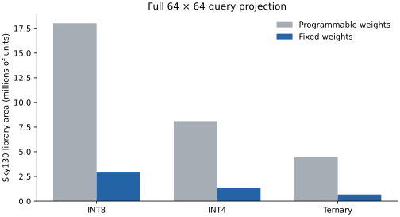

# Fixed-weight area study

A full 64×64 query-projection matrix from the pretrained Stories260K checkpoint,
quantised independently at each weight precision. Both designs buffer the same
INT8 input vector, compute every output dot product in parallel, and serialise
INT32 outputs. The baseline has programmable weight registers; its ternary path
selects the input, its negative, or zero.

| Weights | Fixed area | Programmable area | Programmable / fixed |
|---|---:|---:|---:|
| INT8 | 2,896,038 | 18,022,271 | 6.22× |
| INT4 | 1,306,586 | 8,104,164 | 6.20× |
| Ternary | 667,439 | 4,455,292 | 6.68× |

Area is the sum of mapped Sky130 HD library cell areas, in library units.
This measures the benefit of specialising this datapath to these coefficients.
It is not a comparison with an optimised time-shared accelerator, and it does not
establish clock speed, energy, routed die area or full-model area.

The same Yosys flow and ABC mapping script were used for all six circuits:
strash; &get -n; &nf; &put. No timing constraint or physical placement was applied.
All mapped cells belong to the Sky130 library. The input tensor, RTL hashes,
library hash, tool version and counts are in [area.json](area.json).

Reproduce after fetching Stories260K:

~~~sh
python syn/compare.py models/stories260k --out gen/area \
  --liberty /path/to/sky130_fd_sc_hd__tt_025C_1v80.lib
pip install -r requirements-plot.txt
python syn/plot_comparison.py gen/area/comparison.json --out gen/area/area.svg
~~~
